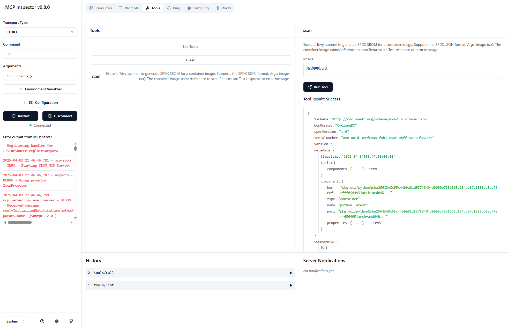

# MCP SBOM Server

[](https://smithery.ai/server/@gkhays/mcp-sbom-server)
[](https://www.python.org/)
[](https://www.anthropic.com/news/model-context-protocol)

MCP server to perform a Trivy scan and produce an SBOM in CycloneDX format.

## Installation

### Installing via Smithery

To install SBOM Server for Claude Desktop automatically via [Smithery](https://smithery.ai/server/@gkhays/mcp-sbom-server):

```bash
npx -y @smithery/cli install @gkhays/mcp-sbom-server --client claude
```

### Prerequisites

Install the following.

- [uv](https://github.com/astral-sh/uv)
- [trivy](https://github.com/aquasecurity/trivy)
- [Node.js](https://nodejs.org/en)

## MCP Clients

### Configuration

```json
"mcpServers": {
        "mcp-sbom": {
            "command": "uv",
            "args": [
                "--directory",
                "/path/to/mcp-sbom",
                "run",
                "mcp-sbom"
            ]
        }
    }
```

## Building

> [!NOTE]
> This project employs `uv`.

1. Synchronize dependencies and update the lockfile.
```
uv sync
```

## Debugging

### MCP Inspector

Use [MCP Inspector](https://github.com/modelcontextprotocol/inspector).

Launch the MCP Inspector as follows:

```
npx @modelcontextprotocol/inspector uv --directory /path/to/mcp-sbom run mcp-sbom
```



### Windows

When running on Windows, use paths of the style:

```console
C:/Users/gkh/src/mcp-sbom-server/src/mcp_sbom
```
